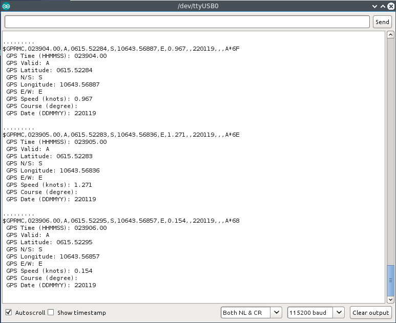

# MyGPS - A Simple GPS GPRMC Parser Library for Arduino
Parsing GPS GPRMC sentence from a GPS serial data, written in C.

## Instalation
* Download as .zip
* Open Arduino IDE.
* From **Sketch**, **Include Library --> Add .ZIP Library...**
* Choose the downloaded .zip. (when downloaded, more likely be named **MyGPS-master.zip**)
* Restart the Arduino IDE

## Usage
```cpp
// include this library
#include <MyGPS.h>          
//include software serial for creating the second serial line
#include <SoftwareSerial.h> 

// Arduino PIN 8 <-- serial data from GPS
// Arduino PIN 9 --> serial data to GPS (not required)
SoftwareSerial gps = SoftwareSerial(8, 9);

// somewhere in your code...
// creating GPS struct variable
GPSresults GPS;
// perform gps GPRMC parsing and save the results into GPS
GPS = gps_parse(gps);
```

## Example
After installation, open your Arduino IDE. From **File**, click **Examples --> MyGPS --> GPS_gprmc_parser**
```cpp
#include <SoftwareSerial.h>
#include <MyGPS.h>

SoftwareSerial gps = SoftwareSerial(8, 9);

void setup()
{
  Serial.begin(115200);
  
  Serial.println(" ");
  Serial.print("Sketch:   ");   Serial.println(__FILE__);
  Serial.print("Uploaded: ");   Serial.println(__DATE__);
  Serial.println(" ");
  
  Serial.println("GPS Struct Test - Started ! \n");

  gps.begin(9600);
}

void loop()
{
  char buff[250];
  
  GPSresults GPS = gps_parse(gps);

  if(GPS.gps_success)
  {    
    sprintf(buff, "\n%s", GPS.gps_rmc);
    
    sprintf(buff, "%s \n GPS Time (HHMMSS): %s", buff, GPS.gps_time);
    sprintf(buff, "%s \n GPS Valid: %c", buff, GPS.gps_valid);
    sprintf(buff, "%s \n GPS Latitude: %s", buff, GPS.gps_lat);
    sprintf(buff, "%s \n GPS N/S: %c", buff, GPS.gps_ns);
    sprintf(buff, "%s \n GPS Longitude: %s", buff, GPS.gps_lon);
    sprintf(buff, "%s \n GPS E/W: %c", buff, GPS.gps_ew);
    sprintf(buff, "%s \n GPS Speed (knots): %s", buff, GPS.gps_spd);
    sprintf(buff, "%s \n GPS Course (degree): %s", buff, GPS.gps_cse);
    sprintf(buff, "%s \n GPS Date (DDMMYY): %s \n", buff, GPS.gps_date);
    
    Serial.println(buff);
  }
}
```
On the Serial Monitor, you can examine the parsing results.


## TODO
* Optimize the code (there is a lot of room for improvements!!)
* Adding capabitilies for parsing other sentences
* ...

## Contributing
1. Fork it [https://github.com/handiko/MyGPS/fork](https://github.com/handiko/MyGPS/fork)
2. Create new branch (`git checkout -b myfeature`)
3. Do some editing / create new feature
4. Commit your works (`git commit -m "Adding some feature blah blah blah.."`)
5. Push to the branch (`git push -u origin myfeature`)
6. Create a new Pull Request
